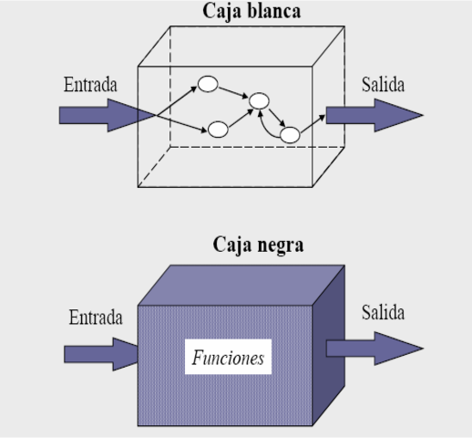
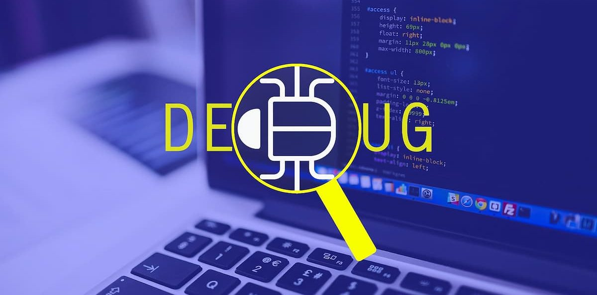
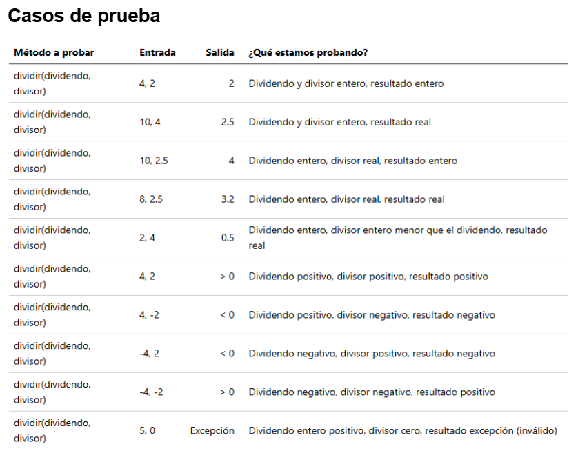
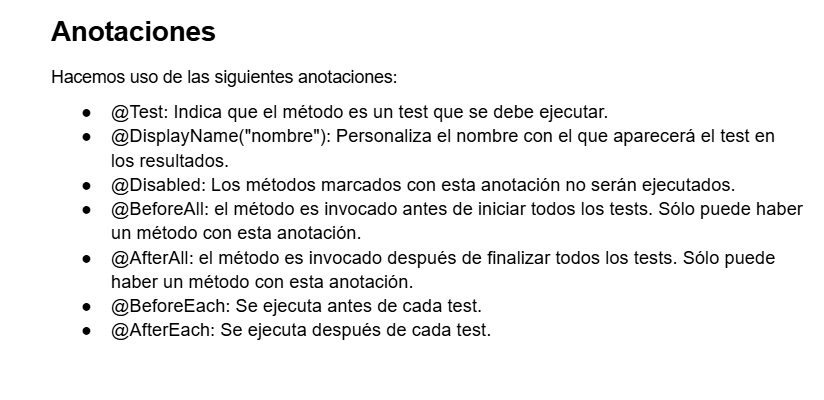
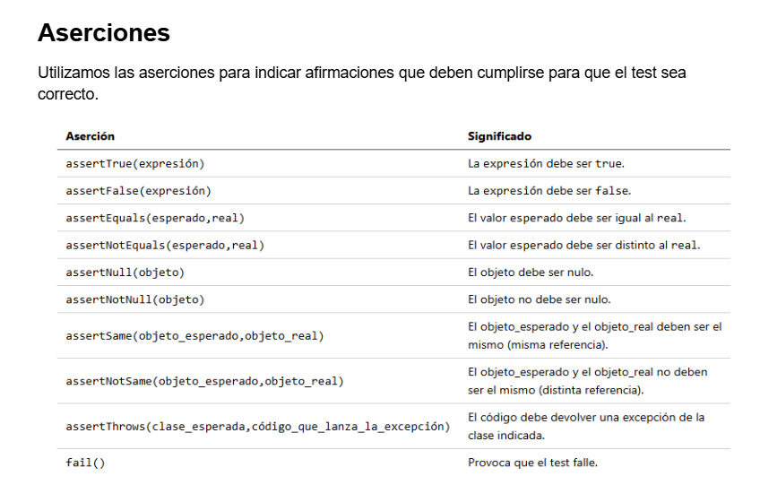

# UT 5: Diseño y realización de pruebas

## 1. Introducción
### ¿Qué es una prueba en desarrollo?
Es una ejecución controlada de nuestro software que se lleva a cabo en unas condiciones concretas.

Una prueba debe tener dos objetivos:

* Comprobar si el software no hace lo que debe hacer.

* Comprobar si el software hace algo que no debe hacer.

### ¿Son importantes las pruebas?
El modelo de desarrollo en cascada, descrito formalmente en 1970 por Winston W. Royce fue propuesto como el mejor modelo de desarrollo. Define 5 fases:

1. Requisitos.
2. Diseño e implementación.
3. Pruebas.
4. Implantación.
5. Mantenimiento.

También sirven para poder refactorizar el código sin introducir nuevos errores.

## 2. Pruebas

### 2.1. Forma de las pruebas

Hay 2 tipos:

* **Pruebas dinámicas:** Requieren la ejecución de la aplicación para poder medir el comportamiento de la aplicación desarrollada.

* **Pruebas estáticas:** Se realizan sin ejecutar el código de la aplicación, examinando el código.

### 2.2. Estrategias de prueba

Hay 2 estrategias principales:

* **Caja negra:** Se estudia el sistema desde fuera, comprobando las funcionalidades que ofrece.

* **Caja blanca:** Se examina el cómo funciona el código por dentro. Son pruebas estructurales.

#### Estrategias de prueba de caja negra

* **Particiones de equivalencia:** consiste en dividir el campo de entrada en un número concreto de clases de equivalencia.
* **Análisis de valores límite:** localizar valores límite y realizar pruebas en el límite.

#### Estrategias de prueba de caja blanca

* **Cobertura de código:** se escriben pruebas para probar todas las sentencias de un programa, todas las decisiones, las condiciones...

* **Prueba de bucles:** consiste en escribir casos de prueba para los bucles del código.

### 2.3. Tipos de pruebas

Hay 2 diferentes categorías:

* **Funcionales:** Evaluan el cumplimiento de los requisitos.
* **No funcionales:** Evaluan aspectos adicionales como rendimiento, seguridad, ...

#### Pruebas funcionales

Pruebas unitarias, Pruebas de regresión, Pruebas de integración, Pruebas de humo, Pruebas del sistema, Pruebas alfa y beta, Pruebas de aceptación.

#### Pruebas no funcionales

Pruebas de usabilidad, Pruebas de rendimiento, Pruebas de stress, Pruebas de seguridad, Pruebas de compatibilidad, Pruebas de portabilidad.

### 2.4. Mecanismos de prueba

* **Manual:** las pruebas son llevadas a cabo por una persona.

* **Automático:** se hace uso de un software que ejecuta código de forma automatizada.

## 3. Debug

Consiste en ejecutar el código de forma controlada con la intención de identificar y determinar la causa de errores.

El programa que se encarga de controlar su ejecución recibe el nombre de **_debugger_**.

Mientras se está ejecutando esta podemos definir **_puntos de ruptura_**.

Otra opción que tenemos es el **_análisis de variables_**.

## 4. Frameworks de testing

Un framework o marco de trabajo es un conjunto de librerías y herramientas.

Ejemplos de frameworks de tests son:

1. **.NET:** xUnit
2. **Java:** JUnit, TestNG
3. **C++:** CppUnit, Google Test
4. **PHP:** PHPUnit
5. **JavaScript:** Mocha

### 4.1. Automatización de pruebas

Para realizar la automatización de pruebas necesitamos implementar casos de prueba usando el framework de tests.

 

### Generar documentación

El IDE nos proporciona, al ejecutar los tests, la información de si estos se han llevado a cabo con éxito o no. 

Pero también podemos generar documentación en HTML o XML para compartir con otra persona.

### Cobertura del código

Es una medida que indica qué porcentaje de código está cubierto por algún test.

### 4.2. TDD

#### ¿Qué es TDD?

Es una metodología de desarrollo que pone a las pruebas en el centro del desarrollo de software, proponiendo que primero se diseñen estas y luego se programe, 
no con el fin de desarrollar una funcionalidad concreta, sino con el de conseguir que el software pase el test.

#### Tests limpios (Clean tests)

Son tests que siguen una serie de buenas prácticas:

* **Usar un nombre descriptivo** para cada test.

* Se estructuran según el **patrón Arrange-Act-Assert (AAA)**:

* **Comprueba un solo comportamiento.**
Sigue los principios **F.I.R.S.T.**:

  * **Fast:** un test debe ser rápido. 
  * **Independent:** un test debe ser independiente respecto de otros tests o servicios externos. 
  * **Repeteable:** un test debe poderse repetible en cualquier entorno, usando datos propios y sin depender de factores externos. 
  * **Self-validating:** cada test debe comprobar por sí solo si falla o se ejecuta correctamente. 
  * **Thorough:** el test debe ser exhaustivo.

## 5. CI / CD

Las siglas **CI / CD** hacen referencia a la **Integración Continua** (Continuous Integration) y a la **Distribución Continua** (Continuous Distribution).

La **Integración Continua** se produce con la mayor frecuencia posible y de forma automatizada gracias a los tests.

La **Distribución Contínua** consiste en subir al repositorio de forma automática.

Por último, está el proceso de **Entrega Contínua** que consiste en poner a prueba la versión de la aplicación que se ha subido al repositorio.

Algunos servidores de CI son:
[Jenkins](https://www.jenkins.io/),
[Bamboo](https://www.atlassian.com/es/software/bamboo),
[TravisCI](https://www.travis-ci.com/),
[CircleCI](https://circleci.com/).

## 6. Calidad

### 6.1. QA y QC

* **Quality Assurance** es un conjunto de actividades para garantizar la calidad en los procesos.
* **Quality Control** es un conjunto de actividades para comprobar la calidad de los productos.

### 6.2. Factores de calidad

Hay 3 categorías:

1. Operación del producto
2. Revisión del producto
3. Transición del producto

