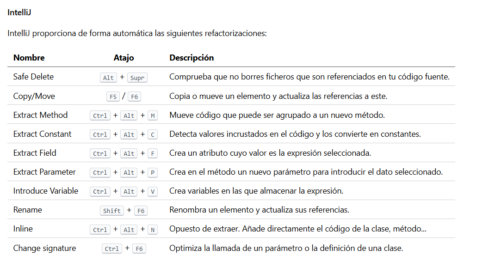
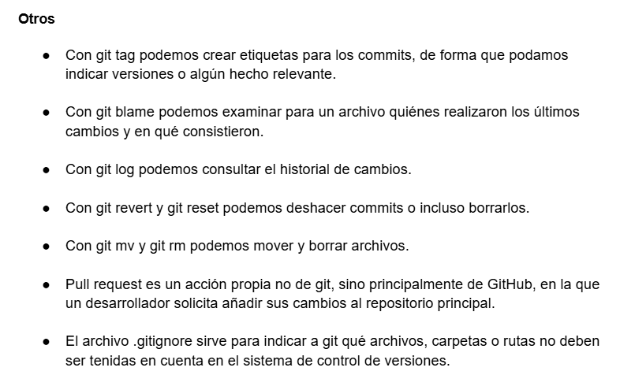
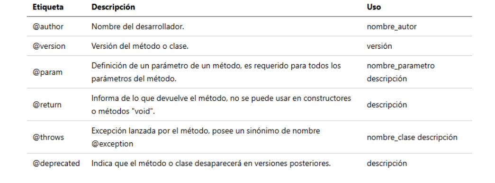
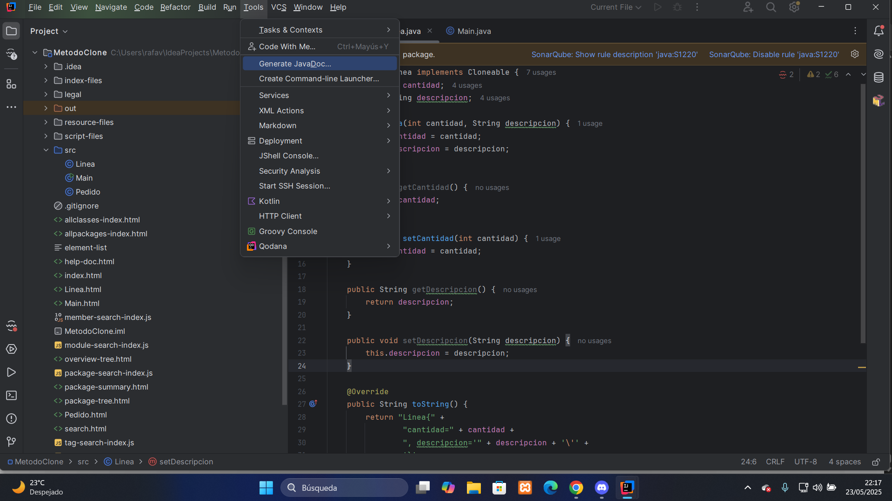
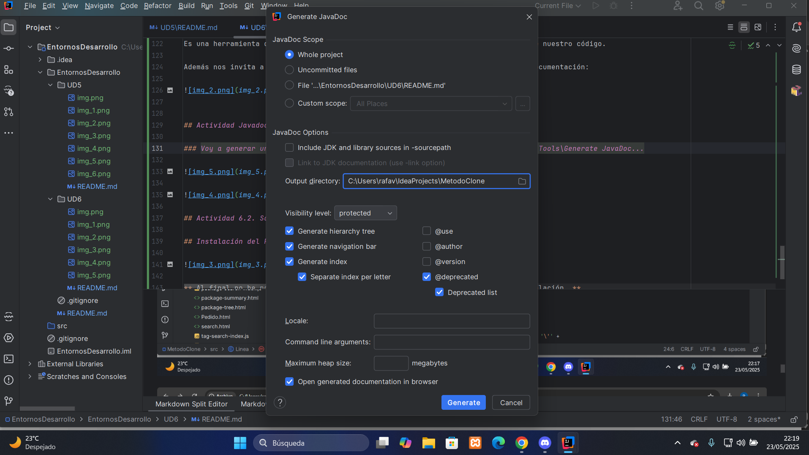
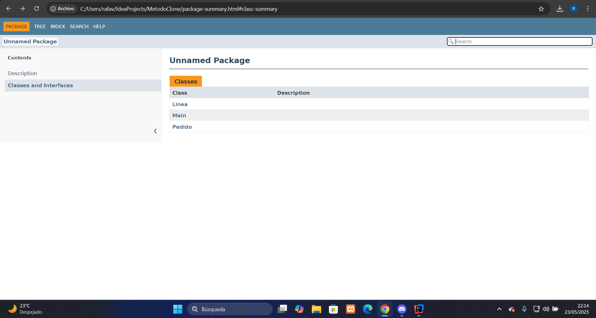
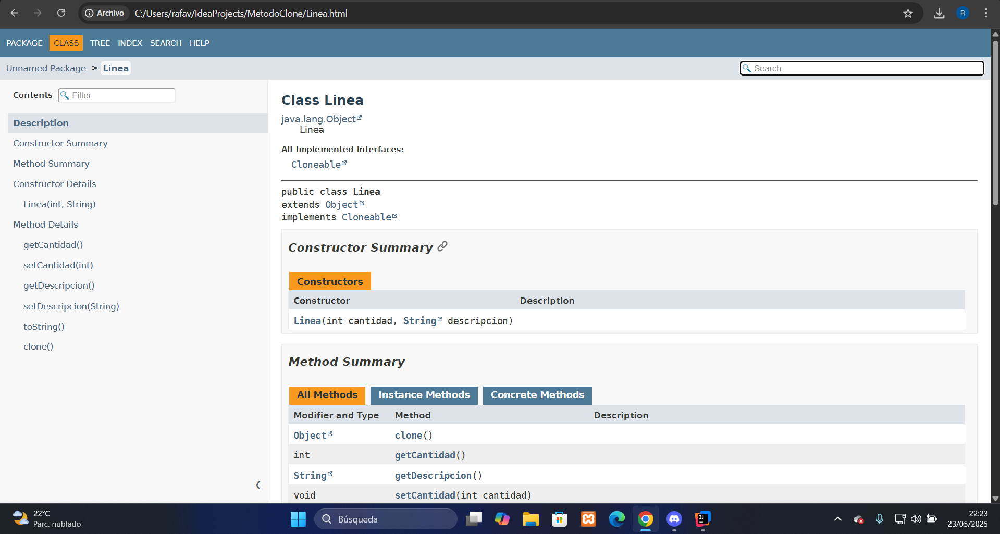
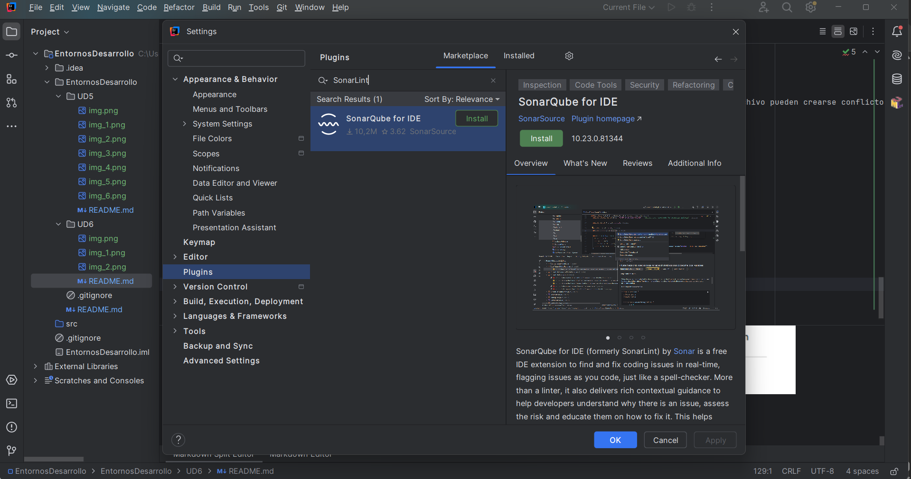
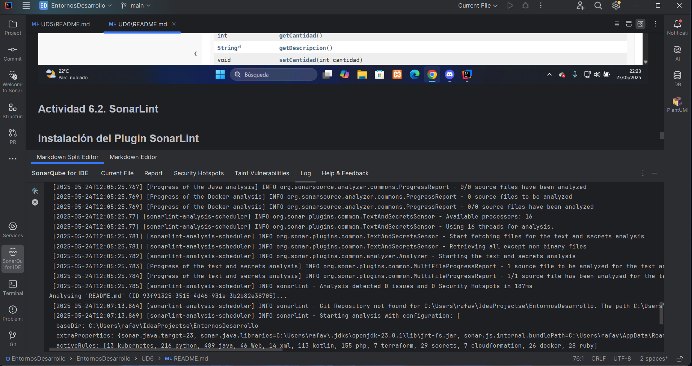
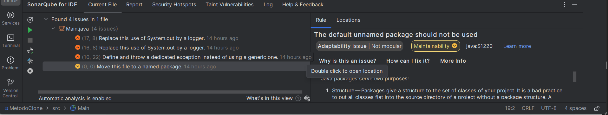

# **UT6. Optimización y documentación**

## 1. Optimización del código

Una forma de optimizarlo es buscar los code smells y eliminarlos.

## 1.1.1. Refactorizaciones

Son estrategias para reestructurar el código de forma que se resuelva un problema de diseño sin cambiar su funcionamiento.

* **Composing Methods:** Estas refactorizaciones se centran en crear métodos y reducir código duplicado.

  * Extract Method
  * Inline Method
  

* **Moving Features Between Objects:** Consisten en mover elementos entre clases.

  * Move Method
  * Move Field
  * Extract Class
  

* **Organizing Data:** Organización de datos.

  * Replace Array with Object
  * Replace Error Code with Exception
  

* **Simplifying Conditional Expressions:** Consisten en simplificar estructuras condicionales.

  * Replace Nested Conditional with Guard Clauses
  * Consolidate Conditional Expression
  

* **Simplifying Method Calls:**

  * Replace Parameter with Explicit Methods
  * Replace Parameter with Method Call
  

* **Dealing with Generalization:** Tienen que ver con mover funcionalidades entre superclases y clases herederas.

  * Pull Up Method
  * Push Down Method

## 1.1.2. Code Smells

Son detalles de cómo está hecho el código, patrones... que nos avisan de que el código está mal.

* **Bloaters:** Son clases, funciones, métodos... que han crecido tanto que es difícil trabajar con ellos.

  * Long Method
  * Long parameter list
  

* **Object Orientation abusers:**

  * Conditional Complexity / Switch Statements
  * Alternative Classes with different interfaces
  

* **Change preventers:** Provocan que, si hacemos algún cambio en el código, haya que realizar más cambios en otros sitios.

  * Divergent Change
  * Shotgun surgery
  

* **Dispensable:** Es un código que no es necesario.

  * Duplicated Code
  * Comentarios
  

* **Couplers:** Provocan un acoplamiento entre clases.

  * Feature Envy
  * Middle Man

## 1.3. Análisis del código

Podemos realizar dos tipos diferentes:

1. Análisis dinámicos
2. Análisis estáticos

#### Linters

Son aplicaciones que revisan el código fuente buscando problemas de estilo, código que no se use, code smells.

Los más conocidos son:

* **lint:** C
* **sonar:** Java
* **JSLint, ESLint:** Javascript

#### Continuous Inspection

Son sitios web que ofrecen inspección de código evaluan su calidad.

Ejemplos: **[SonarQube](https://www.datadoghq.com/dg/monitor/sonarqube/?utm_source=google&utm_medium=paid-search&utm_campaign=dg-infra-emea-sonarqube&utm_keyword=sonar%20static%20code%20analysis&utm_matchtype=p&igaag=145636716709&igaat=&igacm=15832880531&igacr=648075170610&igakw=sonar%20static%20code%20analysis&igamt=p&igant=g&utm_campaignid=15832880531&utm_adgroupid=145636716709&gad_source=1&gad_campaignid=15832880531&gbraid=0AAAAADFY9Nn_uG7CTmr2jVfRmEyVeLARw&gclid=Cj0KCQjwucDBBhDxARIsANqFdr1Jg822bZNP6O4Jp_F2SZHRmdsf4SG0BaPmWbVo8zB7E56TNohPBj8aAn73EALw_wcB), [Scrutinizer](https://scrutinizer-ci.com/).**

## 2. Control de versiones

Son sistemas con los que podemos gestionar los archivos de nuestra aplicación,
registrando los cambios que se van haciendo y permitiendo a los desarrolladores cooperar entre sí.

## 2.1. Flujo de trabajo con git

#### Commit

Si queremos guardar los cambios en el repositorio se utiliza el comando git commit. De esta manera se crea un **punto de guardado**.

#### Ramas (branch)

Con git podemos tener varias líneas de desarrollo en el repositorio, podemos cambiar entre ellas, fusionarlas (git merge) o incluso crear nuevas líneas a partir de estas.

#### Tipos de repositorio

Dos tipos de repositorio:

* Local
* Remoto

#### Hooks

Son eventos a los que podemos asociar scripts.

#### Conflictos

Cuando dos desarrolladores modifican el mismo archivo y fusionan sus cambios, si modifican la misma zona de un archivo pueden crearse conflictos.

## 3. Documentación
## 3.1. Javadoc

Es una herramienta que nos permite generar un documento HTML con la documentación de nuestro código.

Además nos invita a usar etiquetas para remarcar algunos aspectos concretos de la documentación:

## Actividad Javadoc

### Voy a generar un Javadoc de uno de mis códigos. Para realizar esto nos iremos a Tools\Generate JavaDoc...

### Luego nos aparecerá una ventana donde tendremos que seleccionar la ruta donde está el codigo que vamos a generar y le daremos a "Generate".

### Después ya nos aparecerá nuestro JavaDoc generado donde podemos ver las clases que contiene nuestro proyecto seleccionado.

### Si entramos a una de nuestras clases, nos aparecerá información sobre el código de esa clase como los contructores, metodos, etc...

## Actividad 6.2. SonarLint

### Instalación del Plugin SonarLint

### Como podemos ver en la imagen, **SonarLint permite analizar bugs y code smells, detectar vulnerabilidades y organizar los resultados en diferentes opciones (_Current File, Security Hotspots, etc..._)**

### En esta imagen también podemos ver la funcionalidad del SonarLint.
